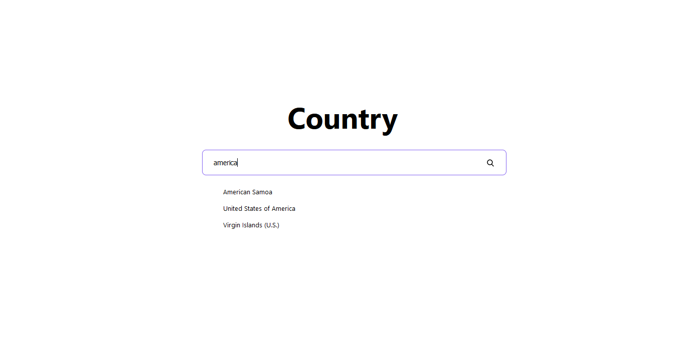
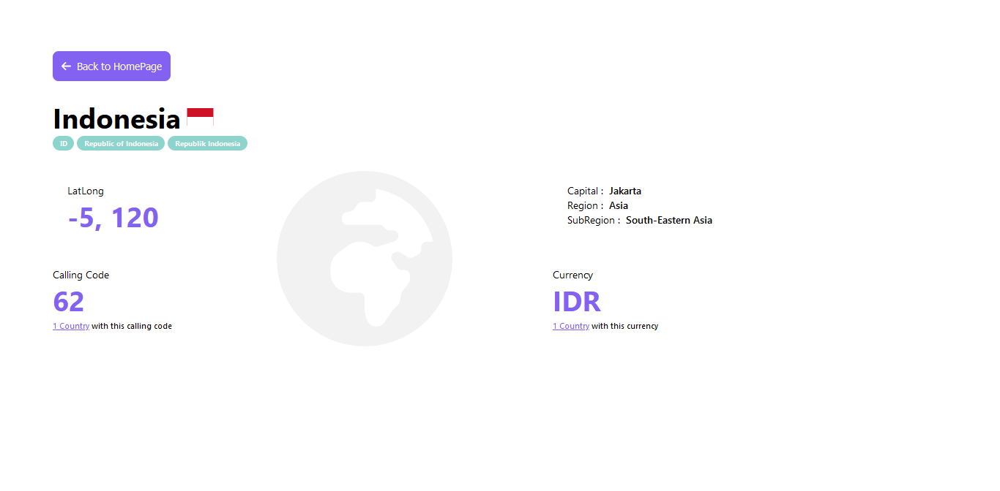

# Country Search Engine
Ini merupakan sebuah web yang berfungsi untuk melakukan data pencarian sebuah negara,
data dari website ini diambil dari API https://restcountries.com/

# Instalasi
1.clone git repository

    git clone https://github.com/dimas3007/Countries.git
    
2.install package
    
    npm install or yarn add

3.run the app
    
    npm start or yarn start
    
# Halaman Website
- Search Countries
- Detail Countries

# Stack yg Digunakan
- React JS
- React Redux
- Redux Thunk
- React Router Dom
- Styled Components
- Axios

# Screenshot

